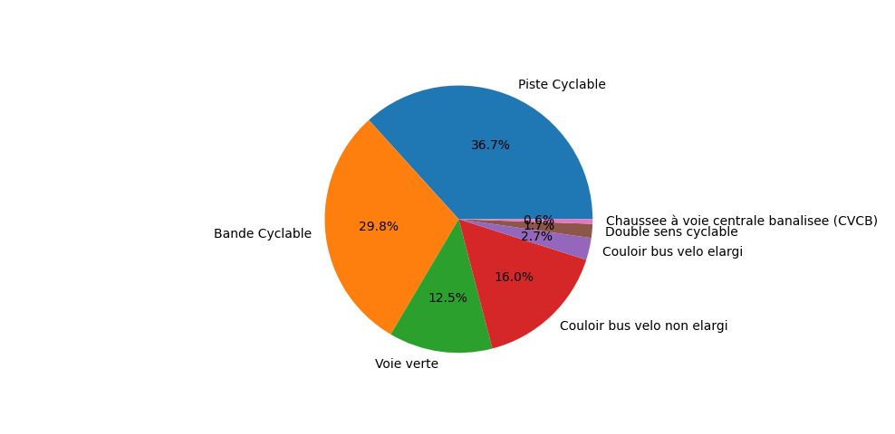
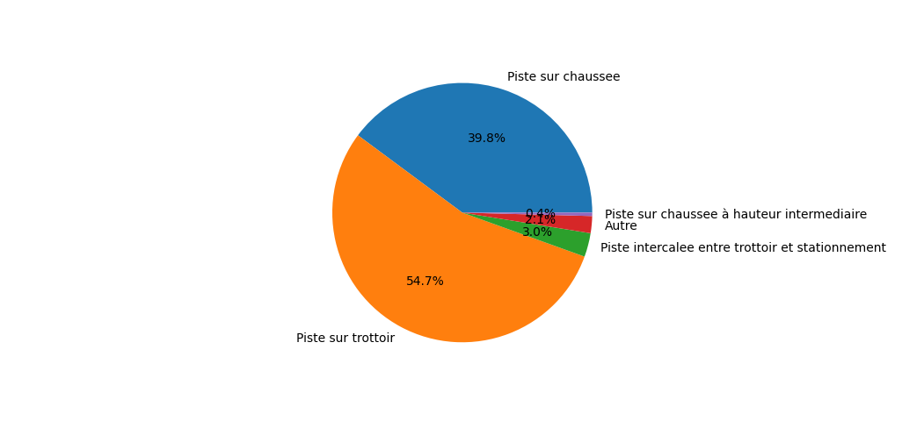
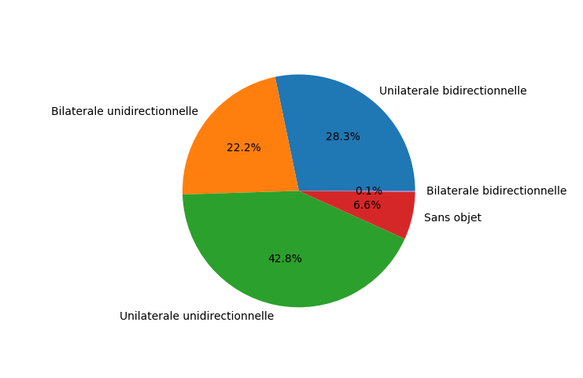

# Vélo

## Introduction

Petite analyse rapide des données disponible sur l'Open Data du grand Lyon.

Les données utilisées pour cet analyse sont :
* [Aménagements cyclables de la Métropole de Lyon](https://data.grandlyon.com/jeux-de-donnees/amenagements-cyclables-metropole-lyon/info)
* [Plan vélo de la Métropole de Lyon](https://data.grandlyon.com/jeux-de-donnees/plan-velo-metropole-lyon/info)

*Les données ont été récupérées le 20/09/2022*

## Aménagements super structurant

Les chiffres clés de l'aménagement cyclables à Lyon :
* Nombre d'aménagements classés comme faisant partie du *Réseau super structurant* : **711** (soit **%** du réseau total)
* Longueur calculée du *Réseau super structurant* : **274 214,29 mètres** (soit **%** du réseau total)

### Quelques graphiques
* **Année de livraison :**

*135 données ne précise pas l'année de livraison (soit 19% des données)*

Hypothèse à creuser : 2020 corona piste qui ont été maintenue ou bien nouveau maire de Lyon.

* **Localisation :**

*1 donnée ne précise pas la localisation (soit 0% des données)*

* **Type d'aménagement :**

*0 donnée ne précise pas le type d'aménagement (soit 0% des données)*

Les bandes cyclables représentent encore une partie importante des aménagements malgré le fait que c'est un des aménagements le moins sécurisé.

Les couloirs de bus partagés sont majoritairement non élargi. Ce n'est pas idéal car ça oblige les chauffeurs à faire un écart pour effectuer un dépassement.

* **Typologie de piste :**

*475 données ne précisent pas la typologie de piste (soit 66,8% des données)*

Malgré le manque de données pour une majorité des aménagements, je trouve qu'il est tout de même intéressant de regarder cet aspect. En effet la majorité des pistes se trouvent dans des zones où des conflits avec d'autres usager peuvent être présent (sur la chaussée ou sur le trottoir)

N.B. : Une précision est nécessaire sur ce qui est considéré comme sur le trottoir (je pense ici à certaines portions de l'avenue Garibaldi).

* **Environnement :**

*1 donnée ne précise pas l'environnement (soit 0% des données)*

Rien de très surprenant ici. L'immense majorité des axes de circulation pour les vélos se situes sur les axes de circulation automobile. Les berges et parc représentent tout de même plus de 5%. Il pourrait être intéressant de comaparer cet aspect avec d'autres villes en France ou dans le monde.

* **Positionnement :**

*0 donnée ne précise pas le positionnement (soit 0% des données)*

* **Réglementation :**

*24 données ne précisent pas la réglementation (soit 3,3% des données)*

* **Zone de circulation apaisée :**

*636 données ne précisent pas la réglementation (soit 89,5% des données)*

Le manque de données peut, peut-être, être expliqué par le fait que seul les pistes dans les zones apaisée sont prise en compte ici.
